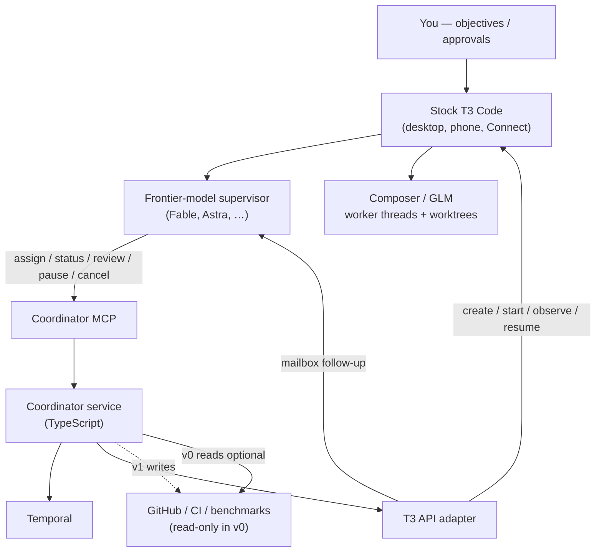
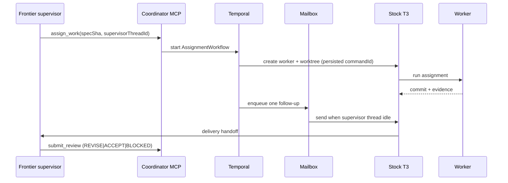

# Architecture

**t3-coordinator** is a TypeScript service that provides durable engineering coordination around unmodified T3 Code. Temporal owns workflow durability; an MCP server exposes domain tools to a **frontier-model supervisor** (Fable, Astra, or equivalent); a narrow T3 adapter creates, observes, and resumes provider sessions. The human surface remains T3 desktop/phone/Connect.

Normative contracts (state machine, MCP schemas, mailbox, reconciliation): [`CONTRACTS.md`](CONTRACTS.md). T3 wire evidence: [`T3-INTEGRATION.md`](T3-INTEGRATION.md) ([pingdotgg/t3code](https://github.com/pingdotgg/t3code)).

ADRs are **Proposed** until the v0 gate passes. See [TESTING.md](TESTING.md).

## Context diagram

## Components

| Component | Responsibility | Depends on |
|---|---|---|
| MCP interface | Domain tools (`assign_work`, `get_work_status`, `get_delivery`, `get_binding`, `submit_review`, `pause_work`, `resume_work`, `cancel_work`) | Official MCP TypeScript SDK; Temporal client |
| Binding CLI | Out-of-band `bind-supervisor` → `~/.t3-coordinator/bindings.json` | Local FS; not MCP |
| Temporal workflows | One v0 type: `AssignmentWorkflow` — lifecycle, waits, retries, mailbox | Temporal (dev server for slice; PostgreSQL in production) |
| Temporal activities | Side-effecting steps: T3 calls, spec-SHA checks | T3 adapter; git |
| T3 adapter | Version-sensitive create/start/observe/interrupt via `POST /api/orchestration/dispatch` and thread snapshot/subscribe; client-supplied `commandId`/`threadId`; reconcile via T3 receipts | Stock T3; [`T3-INTEGRATION.md`](T3-INTEGRATION.md) |
| Follow-up mailbox | Exactly one pending supervisor message per delivery SHA | Adapter + Temporal |
| Coordinator service process | Operator entrypoint (`t3-coordinator start` / `npm start`): Temporal + worker. MCP is host-spawned stdio. | Temporal; local FS bindings |
| Operating profile (optional files) | Operator notes for preferred craft helpers / testbed; not loaded by Temporal | `~/.t3-coordinator/operating-profile.json` — [OPERATING-PROFILE](../experience/OPERATING-PROFILE.md) |
| Stock T3 | Conversations, providers, worktrees, desktop/phone UX | Provider CLIs; Connect |
| Policy module (v1) | PR inspection, CI routing, capacity | GitHub; host controllers |

## Data model

State authorities (do not duplicate competing sources of truth):

| State | Authority |
|---|---|
| Assignments, dependencies, decisions, retries, pending reviews, mailbox | Temporal workflows |
| Conversations, provider sessions, worktree associations, idle/busy thread | T3 |
| Commits, PRs, checks, issue relationships | Git / GitHub |
| Optional searchable summaries | Deferred |

Core durable record: **Assignment** → `specSha` → `baseCommit` → worktree → `commandId` / `workerThreadId` → `deliverySha` → review verdict → revision count → pause/cancel → `supervisorThreadId` + mailbox IDs.

## Domain language and boundaries

| Domain concept | Meaning in this project | Boundary / owner |
|---|---|---|
| Supervisor | Frontier-model session that judges and decides (Fable, Astra, …) | T3 + human via T3 |
| Frontier model | Model class for the supervisor role | Not a single vendor name |
| Worker | Composer, GLM, or similar session executing a bounded assignment | T3 provider thread + isolated worktree |
| Coordinator | Durable mechanics: dispatch, wait, recover, continue | This service |
| Delivery | Commit SHA + verification evidence bound to a spec revision | Worker produces; coordinator records; supervisor reviews |
| Mailbox | Queued follow-up to a named supervisor thread | Coordinator; send only when idle |
| ACCEPT / REVISE / BLOCKED | Review outcomes; ACCEPT ≠ merge | Supervisor via MCP `submit_review` |
| Integration | Authorized merge/closure verification after acceptance | Human/policy + GitHub gates (v1) |

## Key flows

### Vertical slice (v0 gate)

1. Supervisor commits a spec, then calls `assign_work` with `specSha` and `supervisorThreadId`.
2. Temporal `AssignmentWorkflow` persists IDs, then the adapter dispatches an isolated T3 worker.
3. Coordinator process is killed; worker may continue in T3.
4. On restart, reconcile: adopt existing command/thread; do not create a second worker.
5. Delivery recorded → one mailbox item → follow-up when that supervisor thread is idle.
6. `submit_review` REVISE or ACCEPT; revise loops on the same worker within the revision cap.

### Steady-state engineering loop (v1)

1. Inspect existing issues/PRs and coordinated WIP (policy module).
2. Choose an unblocked outcome (repair/integrate before new implementation when backlog is saturated).
3. Dispatch or resume worker; validate/revise against SHAs and CI.
4. On ACCEPT, run authorized integration/verification—not automatic merge.
5. Verify closure; refill capacity when review/integration load allows.

### Supervisor → worker → supervisor

## Cross-cutting concerns

- **Error handling:** Activities are idempotent using T3 command receipts; ambiguous timeouts GET the thread before retry. Fail closed on auth or incompatible T3 version.
- **Configuration:** Coordinator MCP on the **supervisor provider native config**, not T3 `/mcp`. Dedicated pairing with `orchestration:operate` + `orchestration:read`.
- **Security:** Workers do not inherit coordinator MCP. T3 projects are not a filesystem sandbox (`orchestration:read` can read what ubuntu can). Worktrees isolate checkouts only.
- **Completion:** Session/`latestTurn` leaving `running` is turn-end. Delivery is still our commit SHA. `thread.settle` is unrelated.
- **Observability:** Follow-ups per delivery (target 1), duplicate-suppressed launches, revision counts. See [`OBSERVABILITY.md`](OBSERVABILITY.md).
- **Provider lifecycle:** Backend/model changes that T3 rejects mid-thread require new sessions. Supervisor model swaps (Fable ↔ Astra) do not change assignment identity.

## Decisions

- [ADR-0001 — Temporal-centered coordinator around stock T3](adrs/0001-temporal-centered-coordinator.md) — **Proposed** pending v0 gate
- [ADR-0002 — Vanilla PostgreSQL for Temporal persistence](adrs/0002-vanilla-postgres-temporal.md) — **Proposed** for production; not a slice blocker

## Risks & trade-offs

- **T3 API is a versioned RPC contract, not a public extension SDK** — bind to `packages/contracts` shapes; fail closed on schema drift. HTTP dispatch + receipts are real; cross-thread wake is not.
- **Completion→supervisor wake** — mailbox + idle check from T3 turn/session/queued-start; T3 will queue a follow-up onto a busy thread if we send anyway.
- **T3 `/mcp` is not our plugin slot** — it is the `t3-code` preview toolkit. Coordinator tools go on the supervisor provider’s own MCP config.
- **Maintenance pressure** — successful parallelism increases review traffic; resist automating acceptance.
- **Rejected shortcuts** — Jean as primary (breaks T3 phone workflow), AO as default, T3 fork, a second AI manager above the supervisor, hardcoding Astra.
- **Prototype gate** — if restart/idempotency/follow-up proofs fail, keep explicit human handoffs rather than shipping a fragile autonomous loop.
