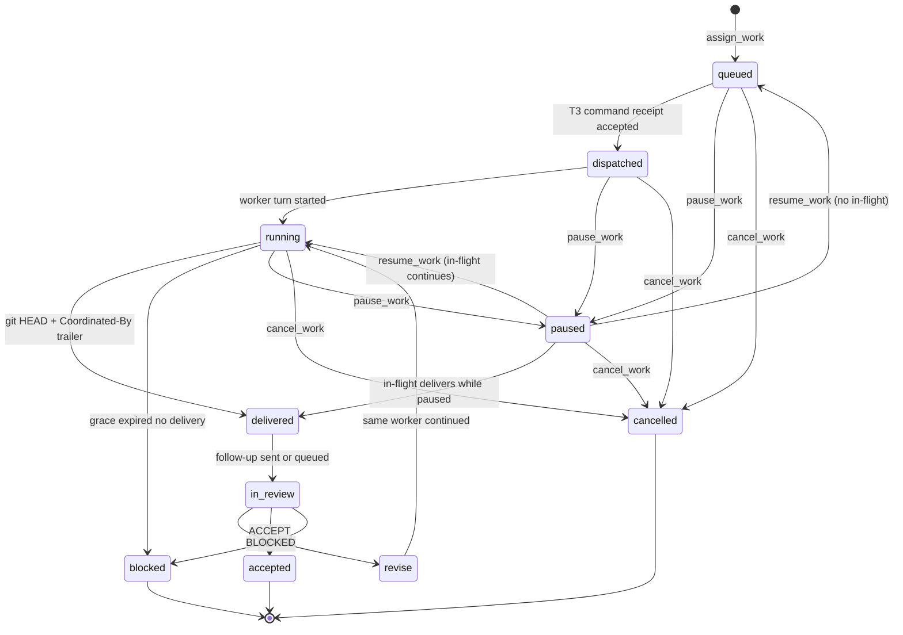

# Contracts

Normative v0 contracts. Architecture explains why; this file is what implementers and tests bind to.

T3 wire format and evidence: [`T3-INTEGRATION.md`](T3-INTEGRATION.md) (from [pingdotgg/t3code](https://github.com/pingdotgg/t3code), not a guess).  
Decisions closing the design critique: [`v0-gate-fix-plan.md`](v0-gate-fix-plan.md).

## Supervisor role

The **supervisor** is a frontier-model session in T3 (Fable, Astra, or equivalent). The coordinator addresses it by:

| Field | Meaning |
|---|---|
| `environmentId` | T3 environment |
| `supervisorThreadId` | Exact T3 thread for follow-ups — from **durable binding**, not model invention |
| `supervisorModelClass` | Role label in *our* records (`frontier`); **not** sent to T3 |
| `supervisorInstanceId` | T3 `ModelSelection.instanceId` |
| `supervisorModelId` | T3 `ModelSelection.model` (e.g. Fable, Astra); never the only identity |

### Supervisor binding (required for MCP)

Native provider MCP has no T3 thread scope. Operators bind out-of-band:

```bash
npx t3-coordinator bind-supervisor --environment <environmentId> --thread <threadId>
```

Writes `~/.t3-coordinator/bindings.json` (override with `T3_COORDINATOR_HOME`).

- `assign_work` **defaults** `supervisorThreadId` from the binding.
- v0 **rejects** a caller-supplied thread id that disagrees with the binding.
- If unbound, `assign_work` fails with `supervisor_unbound`.
- `get_binding` returns the current binding for confirmation.

Workers are separate T3 threads: `workerThreadId` + T3 `instanceId` + `model` + `worktreePath`.

## Assignment state machine



| State | Meaning |
|---|---|
| `queued` | Durable assignment exists; T3 worker not yet confirmed |
| `dispatched` | T3 command receipt **accepted** (`DispatchResult.sequence`). Intent committed; provider may not have started. |
| `running` | Worker `latestTurn.state === "running"` or session `starting`/`running` |
| `delivered` | Worktree `HEAD ≠ baseCommit` **and** tip commit contains `Coordinated-By: <assignmentId>` |
| `in_review` | Follow-up queued or sent to bound `supervisorThreadId` |
| `revise` | Supervisor requested another worker turn on the same assignment |
| `accepted` | Supervisor accepted delivery; **not** merge authorization |
| `blocked` | **Terminal in v0** until a **new** `assign_work`. Reasons include supervisor `BLOCKED`, `no_delivery`, `delivery_unbound` |
| `paused` | No new dispatch; in-flight may finish; mailbox auto-send deferred until `resume_work` |
| `cancelled` | Terminal; interrupt or quarantine; never auto-resumes |

## Delivery observation (FR-3)

Do **not** trust worker chat. After turn-end (session/`latestTurn` leaves `running`):

1. Activity `observeWorktreeDelivery` runs in the worktree: `git rev-parse HEAD`, `git log -1 --format=%B`, `git status --porcelain`.
2. **Delivered** when `HEAD !== baseCommit` and tip message contains `Coordinated-By: <assignmentId>`.
3. If not delivered, wait **delivery grace** (default **5 minutes**), re-observe, then `blocked` with `no_delivery` or `delivery_unbound`.
4. Dirty tree with a matching trailer commit is still `delivered`; evidence includes `dirty: true`.

Evidence (v0): `{ deliverySha, baseCommit, worktreePath, turnId, observedAt, dirty }`.

### Worker prompt contract

Every worker turn prompt must include:

```text
When finished, create a git commit on this worktree whose message body contains exactly:
Coordinated-By: <assignmentId>
Do not claim success without that commit. The coordinator verifies git, not your summary.
```

## Pause vs cancel vs resume

| | `pause_work` | `cancel_work` | `resume_work` |
|---|---|---|---|
| New dispatch | Forbidden | Forbidden | Allowed again |
| In-flight worker | May finish; delivery recorded | Interrupt if T3 allows; else quarantine | Continues if still running |
| Follow-up mailbox | Defer auto-send until resume | Discard pending | Flush deferred if delivered |
| After restart | Remains `paused` | Remains `cancelled` | — |

## Spec SHA gate

`assign_work` is rejected unless `specSha` is a Git object reachable from `baseCommit`. Oral-only assignments are invalid.

## MCP tools

All tools return promptly. Long implementation work is Temporal `AssignmentWorkflow`.

### DX entrypoints

| Tool | Role |
|---|---|
| `run` | Freeform phrase router (`192`, `complete M2`, `complete epic 50`, `critique 192`, …) |
| `issue` | Full issue lifecycle (`status\|plan\|critique\|refine\|update\|narrow\|widen\|explain\|close\|reopen\|create\|push`) |
| `milestone` | Full milestone lifecycle (`list\|status\|plan\|critique\|…\|create\|complete\|close`) |
| `epic` | Parent/epic tracker (children via task-list or sub-issues; milestone optional) |
| `push_issue` / `complete_milestone` / `complete_epic` | Execute next assignment |

GitHub mutations default to **preview**; pass `apply: true` to write.

### `assign_work`

| Field | Required | Notes |
|---|---|---|
| `repo` | yes | Allowed-repo list |
| `specSha` | yes | Committed specification |
| `baseCommit` | yes | Worker worktree base |
| `environmentId` | yes | Must match a supervisor binding |
| `supervisorThreadId` | no | Defaults from binding; mismatch → reject |
| `instanceId` | yes | Worker T3 provider instance |
| `modelId` | yes | Worker model on that instance |
| `goal` | yes | Short bound; does not replace `specSha` |

**Returns:** `{ assignmentId }`  
**Errors:** `supervisor_unbound`, `supervisor_thread_mismatch`, unknown repo, missing spec SHA, concurrency cap.

Idempotency key: (`repo`, `specSha`, `baseCommit`, `environmentId`, `instanceId`, `modelId`) or client-supplied `assignmentId`.

### `get_work_status` / `get_delivery` / `get_binding`

As named. `get_binding` returns `{ environmentId, supervisorThreadId }` or unbound.

### `submit_review`

| Field | Required | Notes |
|---|---|---|
| `assignmentId` | yes | |
| `verdict` | yes | `ACCEPT` \| `REVISE` \| `BLOCKED` |
| `deliverySha` | yes | Must match recorded delivery |
| `notes` | yes for REVISE/BLOCKED | |

### `pause_work` / `resume_work` / `cancel_work`

Input: `assignmentId`. Durable and idempotent.

## Follow-up mailbox (FR-4)

T3 has no cross-thread wake. On `delivered`, enqueue one mailbox item (persist `mailboxId` before send). Send `thread.turn.start` only when the bound supervisor thread is **idle**.

**Busy:** `latestTurn.state === "running"`; session `starting`/`running`; queued turn start; pending approval/user-input.  
**Not detected:** composer draft with no turn — accepted v0 limitation; follow-up may land mid-draft. Operators should `pause_work` before long edits.

Reuse the same T3 `commandId` on retry. Cancel discards pending items. Pause defers send until resume.

## Reconciliation (FR-5)

Persist before every T3 POST: `assignmentId`, `commandId`, `threadId`, `worktreePath`, `mailboxId`.  
T3 receipts are keyed by our `commandId`. Adopt existing threads; never mint a new id on timeout.

**Cancel:** `thread.turn.interrupt`.

## Authz (v0)

- **Supervisor instance:** dedicated Codex (or frontier) instance with coordinator MCP in **that instance’s native config only**.
- **Worker instances:** OpenCode/Cursor (or similar) **without** coordinator MCP. Do not use a shared OpenCode directory config that workers inherit.
- Binding CLI is operator-only (local filesystem), not exposed as a worker tool.
- Allowlist: repos, max concurrent assignments (default 1), max revisions (default 2).
- GitHub: read-only.
- Fail closed on incompatible T3 version or revoked credential.

## Temporal shape (v0)

Required. One workflow type: `AssignmentWorkflow`.  
Task queue: `t3-coordinator`.  
Activities: T3 adapter, `observeWorktreeDelivery`, binding read, mailbox send.  
Spike: `temporal server start-dev`. Production Postgres: ADR-0002.
