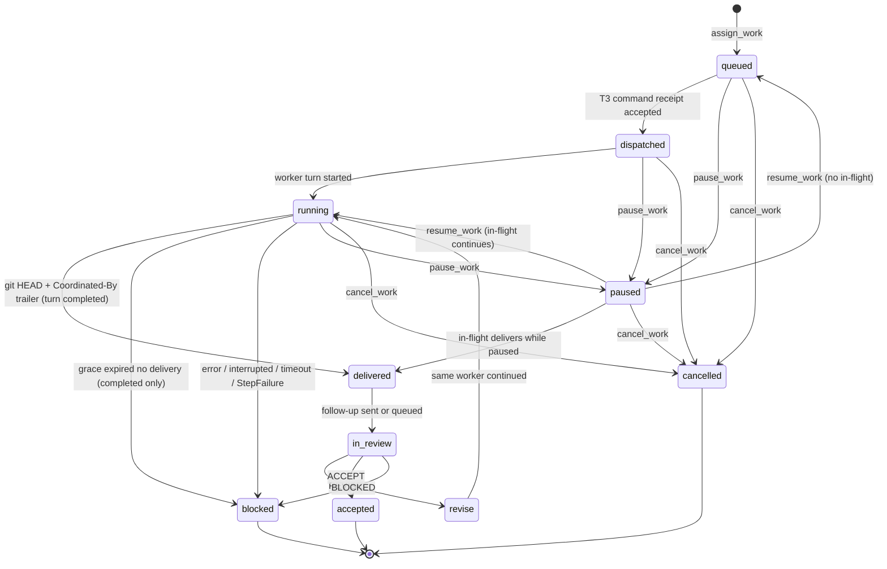

# Contracts

Normative v0 contracts. Architecture explains why; this file is what implementers and tests bind to.

T3 wire format and evidence: [`T3-INTEGRATION.md`](T3-INTEGRATION.md) (from [pingdotgg/t3code](https://github.com/pingdotgg/t3code), not a guess).  
Decisions closing the design critique: [`v0-gate-fix-plan.md`](v0-gate-fix-plan.md).

## Supervisor role

The **supervisor** is any operator MCP session (T3 frontier chat, Cursor, Codex, …) that holds coordinator tools. It is a **thin control plane**: read requirements / `next` / `sitrep`, classify or `start`, then `complete` / `push_issue` / `assign_work` / `submit_review`. On `StepFailed`, signal only `allowedNext`. **Implementation and investigations run in worker sub-agents**, not in the supervisor chat. Classification never plans.

The coordinator addresses mailbox follow-ups by:

| Field | Meaning |
|---|---|
| `environmentId` | T3 environment |
| `supervisorThreadId` | Exact T3 thread for follow-ups — from caller, sticky bind, or coordinator-created **operator inbox** (never model-invented) |
| `supervisorModelClass` | Role label in *our* records (`frontier`); **not** sent to T3 |
| `supervisorInstanceId` | T3 `ModelSelection.instanceId` |
| `supervisorModelId` | T3 `ModelSelection.model` (e.g. Fable, Astra); never the only identity |

### Supervisor binding (mailbox destination)

MCP tools are registered on the **provider** (Codex/Cursor) via `t3-coordinator ensure-mcp` so **any new chat** can see them. No sticky bind is required to call `run` / `sitrep` / `issue`.

For assign/push mailbox follow-ups, resolve in order:

1. Prefer `supervisorThreadId` on the call (this T3 chat’s thread) — we **auto-bind** and update `~/.t3-coordinator/bindings.json`.
2. Or env `COORD_SUPERVISOR_THREAD_ID` / `T3_THREAD_ID`.
3. Or a prior sticky bind for the environment.
4. Else **create and bind** a durable operator inbox thread (`coord:operator-inbox:<environmentId>`) so Cursor/MCP chats can assign without ceremony.

Caller thread **wins** over a stale binding. `supervisor_unbound` is returned only if T3 cannot create the operator inbox (doctor/auth), with an ask to retry the same assign — not to investigate binding in the supervisor chat.

Workers are separate T3 threads: `workerThreadId` + T3 `instanceId` + `model` + `worktreePath`.

### Thin supervisor (normative)

| Supervisor may | Supervisor must not |
|---|---|
| `next` / `sitrep` / read requirements | Implement features in the supervisor session |
| Classify a freeform goal; `start <processId>` after a confident match | Invent a plan, pick closest process on a miss, or start workers from classify |
| `complete` / `push_issue` / `assign_work` | Deep-investigate binding, git, or codebase when assign fails |
| `get_work_status` / `get_delivery` / `submit_review` | Debug coordinator setup instead of retrying after doctor/auth |
| On `StepFailed`, signal one of `allowedNext` (`retry` / `block` / `cancel`) | Write a new plan, spawn an ad-hoc agent, or switch process type from that signal |
| Light backlog shape (`plan` / `critique` with apply) | Parallelize a whole milestone in v0 |

Investigations belong in a **worker assignment** (issue + goal), same as implementation.
## Assignment state machine



| State | Meaning |
|---|---|
| `queued` | Durable assignment exists; T3 worker not yet confirmed |
| `dispatched` | T3 command receipt **accepted** (`DispatchResult.sequence`). Intent committed; provider may not have started. |
| `running` | Worker `latestTurn.state === "running"` or session `starting`/`running` |
| `delivered` | Worktree `HEAD ≠ baseCommit` **and** tip commit contains `Coordinated-By: <assignmentId>` |
| `in_review` | Follow-up queued or sent to bound `supervisorThreadId` |
| `revise` | Supervisor requested another worker turn on the same assignment |
| `accepted` | Supervisor accepted delivery; **not** merge authorization |
| `blocked` | **Terminal in v0** until a **new** `assign_work` or allowed `retry_*`. Reasons include supervisor `BLOCKED`, `no_delivery`, `delivery_unbound`, `worker_turn_failed`, `turn_timeout`, `dispatch_failed`, and other `failureClass` values |
| `paused` | No new dispatch; in-flight **independent** work may finish; mailbox auto-send deferred until `resume_work` |
| `cancelled` | Terminal; interrupt **during wait**; never auto-resumes |

## Delivery observation (FR-3, FR-15)

Do **not** trust worker chat. Capture `{ state, turnId }` from `waitWorkerTurnEnd`. Branch on `state` **before** git grace:

- `error` / `interrupted` → `StepFailure` `worker_turn_failed`; no grace.
- Wait timeout → `StepFailure` `turn_timeout`; wait activity must complete (no infinite poll).
- `completed` → activity `observeWorktreeDelivery` in the worktree: `git rev-parse HEAD`, `git log -1 --format=%B`, `git status --porcelain`.

Then, only for `completed`:

1. **Delivered** when `HEAD !== baseCommit` and tip message contains `Coordinated-By: <assignmentId>`.
2. If not delivered, wait **delivery grace** (default **5 minutes**), re-observe, then `blocked` with `no_delivery` or `delivery_unbound`.
3. Dirty tree with a matching trailer commit is still `delivered`; evidence includes `dirty: true`.

Evidence (v0): `{ deliverySha, baseCommit, worktreePath, turnId, observedAt, dirty }` on success; `StepFailure` on any other terminal.

### Worker prompt contract

Every worker turn prompt must include:

```text
When finished, create a git commit on this worktree whose message body contains exactly:
Coordinated-By: <assignmentId>
Do not claim success without that commit. The coordinator verifies git, not your summary.
```

## Pause vs cancel vs resume

| | `pause_work` | `cancel_work` | `resume_work` |
|---|---|---|---|
| New dispatch | Forbidden | Forbidden | Allowed again |
| In-flight worker | May finish; delivery recorded | Interrupt **while waiting** (`thread.turn.interrupt`); else quarantine | Continues if still running |
| Follow-up mailbox | Defer auto-send until resume | Discard pending | Flush deferred if delivered |
| After restart | Remains `paused` | Remains `cancelled` | — |

## Spec SHA gate

`assign_work` is rejected unless `specSha` is a Git object reachable from `baseCommit`. Oral-only assignments are invalid.

## MCP tools

All tools return promptly. Long implementation work is Temporal `ProcessInstanceWorkflow` → child `AssignmentWorkflow`. No dispatch until `SelectWorkerModel` succeeds ([`MODEL-SELECTION.md`](MODEL-SELECTION.md)).

### DX entrypoints

| Tool | Role |
|---|---|
| `run` | Freeform phrase router (empty/`next` = orient including blocked/failed instances; freeform = classify only; `start <processId>` = instantiate; `192`, `complete M2`, … = ImplementSlice) |
| `next` | Same as empty `run`: goals + backlog brief for supervisor judgment |
| `sitrep` | Standup: accomplished, blockers, coming up (optional `windowDays`) |
| `issue` | Full issue lifecycle (`status\|plan\|critique\|refine\|update\|narrow\|widen\|explain\|close\|reopen\|create\|push`) |
| `milestone` | Full milestone lifecycle (`list\|status\|plan\|critique\|…\|create\|complete\|close`) |
| `epic` | Parent/epic tracker (children via task-list or sub-issues; milestone optional) |
| `push_issue` / `complete_milestone` / `complete_epic` | Execute next assignment |

GitHub mutations default to **preview**; pass `apply: true` to write.

### `assign_work`

| Field | Required | Notes |
|---|---|---|
| `repo` | yes | Allowed-repo list |
| `specSha` | yes | Committed specification |
| `baseCommit` | yes | Worker worktree base |
| `environmentId` | yes | Environment for mailbox binding / operator inbox |
| `supervisorThreadId` | no | Caller wins; else binding; else auto operator inbox |
| `instanceId` | yes | Worker T3 provider instance |
| `modelId` | yes | Worker model on that instance |
| `goal` | yes | Short bound; does not replace `specSha` |

**Returns:** `{ assignmentId }`  
**Errors:** `supervisor_unbound` only when operator inbox create/bind fails (ask → doctor/auth, retry same assign), unknown repo, missing spec SHA, concurrency cap.

Idempotency key: (`repo`, `specSha`, `baseCommit`, `environmentId`, `instanceId`, `modelId`) or client-supplied `assignmentId`.

### `get_work_status` / `get_delivery` / `get_binding`

As named. Also query process instances: artifact heads, **failed steps**, `allowedNext`. `get_binding` returns `{ environmentId, supervisorThreadId }` or unbound.

### `submit_review`

| Field | Required | Notes |
|---|---|---|
| `assignmentId` | yes | |
| `verdict` | yes | `ACCEPT` \| `REVISE` \| `BLOCKED` |
| `deliverySha` | yes | Must match recorded delivery |
| `notes` | yes for REVISE/BLOCKED | |

### `pause_work` / `resume_work` / `cancel_work`

Input: `assignmentId`. Durable and idempotent.

## Follow-up mailbox (FR-4, FR-14)

T3 has no cross-thread wake. Every **terminal** enqueues exactly one mailbox item (persist `mailboxId` before send):

- **Delivery** — SHA-bound; same idle rules as today.
- **Failure** — class-bound `StepFailed` payload (`processInstanceId`, `stepId`, `assignmentId`, `workerThreadId`, `failureClass`, evidence, `attempted`, `allowedNext`). Duplicate suppression: stable id from `assignmentId + failureClass + attempt`.

Send `thread.turn.start` only when the bound supervisor thread is **idle**.

**Busy:** `latestTurn.state === "running"`; session `starting`/`running`; queued turn start; pending approval/user-input.  
**Not detected:** composer draft with no turn — accepted v0 limitation; follow-up may land mid-draft. Operators should `pause_work` before long edits.

Reuse the same T3 `commandId` on retry. Cancel discards pending items. Pause defers send until resume. `get_work_status` / `next` / `sitrep` show the failed step even if the mailbox has not been read.

## Reconciliation (FR-5)

Persist before every T3 POST: `assignmentId`, `commandId`, `threadId`, `worktreePath`, `mailboxId`.  
T3 receipts are keyed by our `commandId`. Adopt existing threads; never mint a new id on timeout. Activity retries must not mint a new `messageId`.

**Cancel:** race wait with `thread.turn.interrupt` immediately (not after turn end).

## Authz (v0)

- **Supervisor instance:** dedicated Codex (or frontier) instance with coordinator MCP in **that instance’s native config only**.
- **Worker instances:** OpenCode/Cursor (or similar) **without** coordinator MCP. Do not use a shared OpenCode directory config that workers inherit.
- Binding CLI is operator-only (local filesystem), not exposed as a worker tool.
- Allowlist: repos, max concurrent assignments (default 1), max revisions (default 2, including first run; REVISE counts toward `retry_same`).
- GitHub: read-only.
- Fail closed on incompatible T3 version or revoked credential.

## Temporal shape (v0)

Required. Interpreter: `ProcessInstanceWorkflow` (one type; catalog files define the DAG + required `onFail`). Child: `AssignmentWorkflow` per worker/check step.  
Task queue: `t3-coordinator`.  
Activities: T3 adapter (including WS `server.getConfig` / `server.refreshProviders`), `observeWorktreeDelivery`, `SelectWorkerModel`, binding read, mailbox send.  
Spike: `temporal server start-dev`. Production Postgres: ADR-0002.
