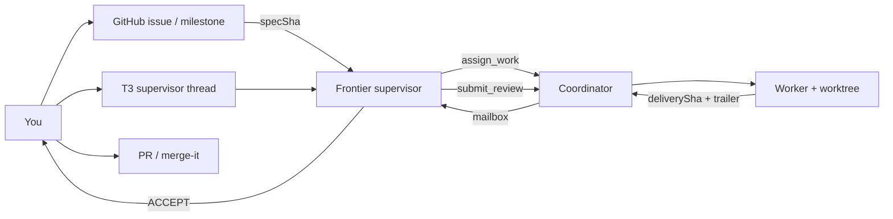

# DX paths

How humans and the frontier-model supervisor use **t3-coordinator** on the paired **[dev-skills](https://github.com/DecisionNerd/dev-skills) repo** ([TESTBED.md](TESTBED.md)).

Workflow shape matches our paired **operator SDLC** ([TESTBED.md](TESTBED.md)): **DocSlime** (docs spine), **RedTeam** (challenge before commit), **Impeccable** (design craft), plus delivery skills (`issues`, `milestones`, `recon issue`, `check-readiness`, `merge-it`). Those run on the **operator machine** — they are **not** installed on OVHC. On OVHC you still need a `dev-skills` **checkout** as the T3 project; run craft wherever you have Cursor/`gh`.

GitHub remains the **intent and audit** system. The coordinator remains the **durable handoff** system. Do not invent a second backlog inside Temporal.

## Mapping

| GitHub / craft | Coordinator | Notes |
|---|---|---|
| Milestone | Campaign objective (many turns) | Close criteria stay on the milestone |
| Issue | One bounded outcome | Prefer one `assign_work` → one delivery SHA → review |
| Issue body + BDD scenarios | Spec commit (`specSha`) | Oral-only assign is invalid |
| `recon issue` plan | Spec (or plan commit) before dispatch | Plan can live in-repo or on the issue |
| Implement (`fix-it` / code) | Worker assignment | Isolated worktree; trailer required |
| Review / `check-readiness` | `submit_review` ACCEPT \| REVISE \| BLOCKED | ACCEPT ≠ merge |
| `merge-it` / ship | Human (v0) / policy (v1) | After ACCEPT |



---

## Path A — Manual design → plan → sub-agent implement → review

**When:** You are shaping something new (API, UX contract, risky refactor). Judgment stays with you + supervisor; mechanics go to the worker.

### Steps

1. **Design (human + craft)**  
   Sketch constraints in the issue or a design note. **DocSlime** keeps PRODUCT/DESIGN/REQUIREMENTS honest; **Impeccable** (`shape` / `critique`) when the surface is operator-facing; **RedTeam** (`critique` / `challenge`) before locking the frame. Use `issues create` / `refine` so scope and non-goals are explicit.

2. **Plan (`recon issue` or supervisor plan)**  
   Produce a falsifiable plan: files, risks, BDD Given/When/Then, stop conditions. Optional **RedTeam** `premortem` on the plan. Commit the plan or issue-linked spec object → **`specSha`**.

3. **Bind + assign**  
   Supervisor (or you via MCP) calls `assign_work` with `specSha`, `baseCommit`, goal excerpt pointing at the plan, worker `instanceId`/`modelId`. Coordinator starts `AssignmentWorkflow`.

4. **Sub-agent implement**  
   Worker runs in an isolated worktree. Delivery = new commit whose message contains `Coordinated-By: <assignmentId>`. Narratives without that commit do not count.

5. **Review**  
   Mailbox wakes the supervisor when idle. Supervisor inspects the worktree/diff (via T3) and `submit_review`:
   - **REVISE** — same assignment continues (v0 records revise; follow-up turn is the loop)
   - **ACCEPT** — ready for your `check-readiness` / PR path (optional **RedTeam** `review` on the change set)
   - **BLOCKED** — stop for human

6. **Integrate**  
   You (or `merge-it`) open/land the PR from the worker branch/worktree. Coordinator does not auto-merge.

### Operator checklist

- [ ] Issue exists with BDD completion scenarios  
- [ ] Spec committed (`specSha`)  
- [ ] Supervisor bound; MCP loaded on supervisor only  
- [ ] `assign_work` returned `assignmentId`  
- [ ] Delivery SHA observed (not just “done”)  
- [ ] Review verdict recorded  
- [ ] PR linked to the issue  

---

## Path B — Milestone goal (many turns)

**When:** A release-shaped slice with several issues (same pattern as `milestones` → complete critical-path issues). Expect tens of supervisor/worker turns; durability matters.

### Shape the milestone (GitHub)

1. `milestones create` / `plan` — title, close criteria, issue membership.  
2. Keep WIP honest: `critique` / `narrow` before flooding workers.  
3. Default execution order = **critical-path open issue**, same as the milestones skill — not “spawn all workers.”

### Run the campaign (coordinator)

For each issue in order:

| Beat | Actor | Action |
|---|---|---|
| Orient | Supervisor | Read milestone + next issue; confirm still unblocked |
| Spec | Supervisor / you | Ensure issue has plan/`specSha` (`recon issue` if missing) |
| Dispatch | Supervisor | `assign_work` (one worker per issue unless issue says otherwise) |
| Wait | Coordinator | Turn-end → delivery grace → mailbox |
| Judge | Supervisor | `submit_review`; REVISE until ACCEPT or BLOCKED |
| Land | You | PR + `check-readiness` + `merge-it` |
| Advance | Supervisor | Next critical-path issue; `get_work_status` if unsure |

### Multi-turn rules

- **One in-flight implementation worker per issue** in v0 (no GraphForge-style capacity policy yet).  
- **Pause** the assignment if you need the supervisor thread for design discussion (`pause_work`); **resume** when ready.  
- **Cancel** if the issue is descope’d; do not reuse a cancelled `assignmentId`.  
- Milestone close criteria stay on GitHub — coordinator status is per-assignment, not “milestone %.”  
- Prefer finishing REVISE loops on the current issue over opening a second implementation front.

### Suggested supervisor prompt skeleton

```text
Repo under test: DecisionNerd/dev-skills (T3 project checkout — not “skills installed on host”).
Milestone: <title> — close when <criteria>.
Critical-path issue: #<n> — <title>.
Spec: <specSha> at base <baseCommit>.
Assign Composer/GLM to implement only that issue’s acceptance scenarios.
After delivery, review against the issue BDD; ACCEPT only if evidence matches.
Do not start the next issue until this one is ACCEPTed or BLOCKED with a human note.
```

---

## Path C — Single issue

**When:** One bug or small feature. Same default as `issues` with only `#N`: execute completion, don’t menu admin.

### Steps

1. **Resolve** — `gh issue view #N` (or supervisor reads the issue).  
2. **Shape only if blocked** — `refine` / narrow; otherwise skip admin.  
3. **Plan** — `recon issue #N` → commit plan → `specSha` (skip only if the issue *is* the spec and already committed).  
4. **`assign_work`** — goal cites `#N` and the BDD scenarios; worker model cheap.  
5. **Delivery + review** — trailer commit; supervisor `submit_review`.  
6. **Close the loop** — PR fixes `#N`; `check-readiness`; `merge-it`; issue closes via GitHub.

### Tiny vs non-tiny

| Issue size | Coordinator use |
|---|---|
| Trivial (docs typo, one-liner) | Optional — you may fix without a worker |
| Bounded feature/bug | Path C as written |
| Spans multiple packages / unclear AC | Promote to Path A (design) or split issues under a milestone (Path B) |

---

## Anti-patterns

| Don’t | Do instead |
|---|---|
| Treat Temporal / MCP as the backlog | Keep issues & milestones on GitHub |
| Assign without `specSha` | Commit the plan or refuse |
| Point `worktreePath` at the main checkout | Let the adapter create `~/.t3-coordinator/worktrees/…` |
| Send mailbox while supervisor turn is running | Wait for idle (coordinator already defers when busy) |
| ACCEPT and assume merged | Run your normal PR / `merge-it` path |
| Give workers coordinator MCP | Supervisor provider only |
| Parallelize a whole milestone in v0 | Critical-path issue, then the next |

---

## Related

- [TESTBED.md](TESTBED.md) — `dev-skills` repo + DocSlime / RedTeam / Impeccable / delivery craft (not OVHC installs)  
- [QUICKSTART.md](QUICKSTART.md) — install, auth, bind, smoke  
- [../PRODUCT.md](../PRODUCT.md) — why coordination exists  
- [../engineering/CONTRACTS.md](../engineering/CONTRACTS.md) — tools and states  
- [../engineering/TESTING.md](../engineering/TESTING.md) — v0 gate on `dev-skills`  
- Operator SDLC skills: DocSlime, RedTeam, Impeccable, `issues`, `milestones`, `recon issue`, `check-readiness`, `merge-it`
