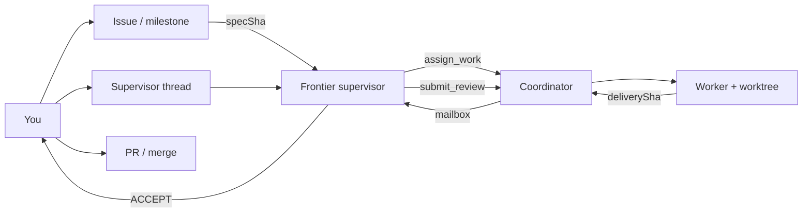

# DX paths

Three ways to use the coordinator. GitHub (or your tracker) holds intent; the coordinator holds durable handoffs. Journeys assume a project checkout in T3 — start with [dev-skills](https://github.com/DecisionNerd/dev-skills) or whatever you set in [TESTBED.md](TESTBED.md).

Helpers named below (DocSlime, RedTeam, `recon`, …) are optional — use them if you have them, or the equivalent steps by hand. To change the defaults, edit your [profile](OPERATING-PROFILE.md).

## At a glance

| Your work item | Coordinator |
|---|---|
| Milestone | Many turns; close criteria stay on the milestone |
| Issue | One `assign_work` → one delivery SHA → review |
| Issue + BDD | Committed `specSha` (oral assign does not count) |
| Plan | Spec commit before dispatch |
| Implementation | Worker in an isolated worktree + trailer |
| Review | `submit_review`: ACCEPT \| REVISE \| BLOCKED |
| Ship | You merge (ACCEPT ≠ merge) |



---

## Path A — Design → plan → implement → review

**When:** New API, UX contract, or risky refactor. You and the supervisor keep judgment; the worker does the mechanical build.

1. **Design** — Capture constraints on the issue (or a design note). Tighten docs if you use DocSlime; critique the frame if you use RedTeam/Impeccable.  
2. **Plan** — Falsifiable plan: files, risks, BDD, stop conditions. Commit it → **`specSha`**.  
3. **Assign** — Supervisor `assign_work` with `specSha`, `baseCommit`, goal, worker model.  
4. **Implement** — Worker in an isolated worktree. Delivery = commit message containing `Coordinated-By: <assignmentId>`.  
5. **Review** — Mailbox wakes the supervisor when idle. `submit_review`: REVISE (continue), ACCEPT (ready for PR), or BLOCKED (human).  
6. **Integrate** — You open/land the PR. Coordinator does not auto-merge.

**Checklist**

- [ ] Issue with BDD scenarios  
- [ ] Spec committed (`specSha`)  
- [ ] Supervisor bound; MCP on supervisor only  
- [ ] `assignmentId` returned  
- [ ] Delivery SHA (not just “done”)  
- [ ] Review verdict  
- [ ] PR linked to the issue  

---

## Path B — Milestone (many turns)

**When:** A release-shaped slice with several issues. Expect many supervisor/worker turns; durability matters.

**Shape on GitHub:** milestone title, close criteria, issue list. Keep WIP honest before flooding workers. Default order = **next critical-path open issue**, not “spawn everyone.”

**Each issue**

| Beat | Who | Action |
|---|---|---|
| Orient | Supervisor | Milestone + next issue still unblocked? |
| Spec | You / supervisor | Plan committed (`specSha`) |
| Dispatch | Supervisor | `assign_work` |
| Wait | Coordinator | Turn-end → delivery → mailbox |
| Judge | Supervisor | `submit_review` until ACCEPT or BLOCKED |
| Land | You | PR + merge |
| Advance | Supervisor | Next issue |

**Rules of thumb:** one implementation worker per issue in v0; `pause_work` if the supervisor thread needs a design digression; `cancel_work` if the issue dies; finish REVISE before opening another front.

**Supervisor prompt skeleton**

```text
Repo: <T3 project>.
Milestone: <title> — close when <criteria>.
Critical-path issue: #<n> — <title>.
Spec: <specSha> at base <baseCommit>.
Implement only that issue’s acceptance scenarios.
Review against the issue BDD; ACCEPT only with matching evidence.
Do not start the next issue until ACCEPT or BLOCKED with a human note.
```

---

## Path C — Single issue

**When:** One bug or small feature.

1. Read `#N`.  
2. Refine only if blocked; otherwise skip admin.  
3. Plan → commit → `specSha` (skip only if the issue *is* already the committed spec).  
4. `assign_work` citing `#N` and BDD.  
5. Delivery + `submit_review`.  
6. PR that closes `#N`.

| Size | Use |
|---|---|
| Trivial typo / one-liner | Fix yourself; skip the coordinator |
| Bounded feature/bug | Path C |
| Unclear AC / multi-package | Path A or split under a milestone (B) |

---

## Don’t

| Don’t | Do |
|---|---|
| Treat Temporal as the backlog | Keep issues on GitHub |
| Assign without `specSha` | Commit the plan first |
| Point worktree at the main checkout | Let the adapter create `~/.t3-coordinator/worktrees/…` |
| ACCEPT and assume merged | Run your normal PR path |
| Give workers coordinator MCP | Supervisor provider only |
| Parallelize a whole milestone in v0 | One critical-path issue at a time |

---

## Related

[QUICKSTART.md](QUICKSTART.md) · [TESTBED.md](TESTBED.md) · [OPERATING-PROFILE.md](OPERATING-PROFILE.md) · [../engineering/CONTRACTS.md](../engineering/CONTRACTS.md)
