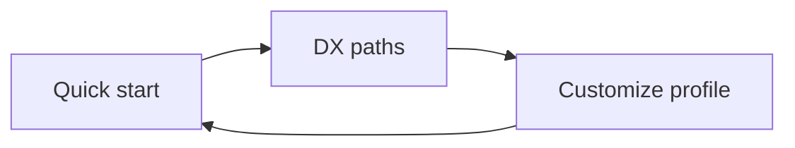

# Experience

How to run **t3-coordinator** day to day: install, bind a supervisor, assign work, and review deliveries — without carrying messages between agents.

**Published site:** [decisionnerd.github.io/t3-coordinator](https://decisionnerd.github.io/t3-coordinator/) (`website/` · `npm run docs:dev`)

## Start here

| Doc | Use it when |
|---|---|
| [QUICKSTART.md](QUICKSTART.md) | First install and first assignment |
| [TESTBED.md](TESTBED.md) | Choosing which repo opens in T3 |
| [DX-PATHS.md](DX-PATHS.md) | Design, milestone, or single-issue loops |
| [OPERATING-PROFILE.md](OPERATING-PROFILE.md) | Changing helpers / prompts without reinstalling |

## What good feels like

- You (or the supervisor) commit a spec, call `assign_work`, and walk away.  
- A worker delivers a real commit with a `Coordinated-By` trailer.  
- The supervisor wakes once, reviews, and ACCEPTs / REVISEs / BLOCKs.  
- Kill the coordinator mid-flight and it recovers the same worker — no duplicate launches.  
- Issues and milestones stay on GitHub; the coordinator never becomes a second backlog.

## Habits that keep the DX clean

- Spec before assign (`specSha`).  
- MCP on the supervisor provider only.  
- One implementation front at a time in v0.  
- ACCEPT ≠ merge — you still land the PR.  
- Prefer editing profile/prompts when the *process* changes; leave the installed coordinator alone.

