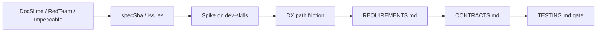

# Experience

Operator and agent experience for **t3-coordinator**: GitHub intent + durable T3 handoffs on the paired **[dev-skills](https://github.com/DecisionNerd/dev-skills) repository**, shaped by our **DocSlime / RedTeam / Impeccable** SDLC craft ([TESTBED.md](TESTBED.md)).

## Discovery practice

Learn from live spikes on that repo, supervisor review quality, and whether humans still paste handoffs. Promote repeated friction into [REQUIREMENTS.md](../REQUIREMENTS.md).

**Do not confuse** the `dev-skills` **git testbed** or the **operator craft stack** with installing agent skills on OVHC — see [TESTBED.md](TESTBED.md).

## Experience principles

- **Paired repo first** — v0 proof runs on `dev-skills`, not GraphForge/XYG.
- **Paired SDLC craft** — DocSlime (docs), RedTeam (challenge), Impeccable (design), then issues/milestones delivery — on the operator machine.
- **GitHub owns intent** — issues and milestones stay the backlog; coordinator owns waits and recovery.
- **Evidence over chat** — delivery and review bind to SHAs and trailers, not agent summaries.
- **Supervisor judges; workers build** — MCP tools on the supervisor provider only.
- **Small batches** — one issue → one assignment → review before opening the next front (v0).

## Index

| Document | Kind | Status | What it informs |
|---|---|---|---|
| [TESTBED.md](TESTBED.md) | Pairing | Active | `dev-skills` repo + DocSlime / RedTeam / Impeccable SDLC |
| [QUICKSTART.md](QUICKSTART.md) | Runbook | Active | First successful session |
| [DX-PATHS.md](DX-PATHS.md) | Journey | Active | Design / milestone / single-issue loops |

## Traceability

