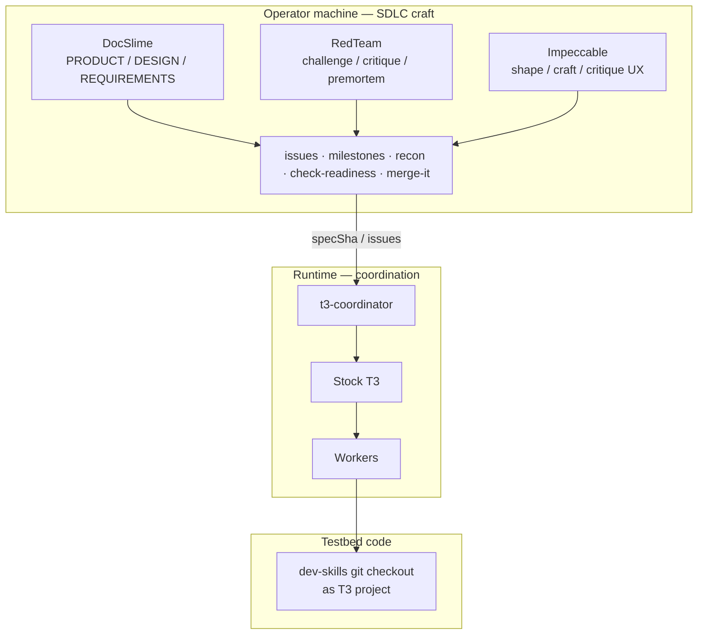

# Pairings: testbed + SDLC craft

**t3-coordinator** is deliberately paired with two things that must not be confused:

1. The **[DecisionNerd/dev-skills](https://github.com/DecisionNerd/dev-skills) git repository** — v0 code testbed (T3 project / worktrees / commits).
2. Our **operator SDLC craft stack** — DocSlime, RedTeam, Impeccable, plus issues/milestones delivery skills.

Neither packing those agent skills onto **OVHC** nor treating the `dev-skills` *repo* as “skills installed on the host.” OVHC needs a **clone of the repo** as a T3 project. Craft runs on the operator machine (Cursor / Claude / local agents) that shapes GitHub and reviews decisions.



## 1. Code testbed — `dev-skills` repo

| What | Where | Role |
|---|---|---|
| **[dev-skills](https://github.com/DecisionNerd/dev-skills) repo** | GitHub + clone on local and/or OVHC, added as a T3 project | Scratch codebase for assignments, delivery SHAs, trailers |
| **Craft skills pack** | Optional on operator machine | Not required on OVHC |

Do not point GraphForge/XYG at the coordinator until the v0 gate on **`dev-skills`** is green.

### Paths used in the local spike

| Item | Value (local Mac spike) |
|---|---|
| Repo | `https://github.com/DecisionNerd/dev-skills` |
| Typical checkout | `/Users/davidspencer/Code/GitHub/dev-skills` |
| T3 project title | `dev-skills` |
| T3 project id (this environment) | `fcddb699-b5ba-4c4b-a2b7-38ea2bf3e0ed` |

OVHC may use a different clone path and project id — record them here when the remote gate runs.

## 2. Operator SDLC craft (paired, not OVHC-installed)

These skills are how we **decide and document** before/while the coordinator **dispatches and recovers**. They are first-class pairings for t3-coordinator’s operating model.

| Skill family | Commands / surface | Role in this SDLC |
|---|---|---|
| **DocSlime** | `docslime-init` / `fill` / `kiss` / `adr` / `install` | Product spine: PRODUCT, DESIGN, REQUIREMENTS, engineering docs, ADRs. Spec and contracts come from here before `assign_work`. |
| **RedTeam** | `challenge`, `critique`, `review`, `premortem`, … | Adversarial check of plans, ADRs, DX paths, and “ready to assign” specs. Loyal opposition before commitment — not pentest. |
| **Impeccable** | `shape`, `craft`, `critique`, `polish`, … | Design craft when there is a human-facing or branded surface; for this service, also MCP/operator copy and any future UI. Design SERVES the product (tool register). |
| **Delivery craft** | `issues`, `milestones`, `recon issue`, `check-readiness`, `merge-it` | GitHub intent → plan → PR → close. Maps onto [DX-PATHS.md](DX-PATHS.md). |

### Where each sits on a turn

| Beat | Prefer | Coordinator does |
|---|---|---|
| Frame product / docs | DocSlime | — |
| Stress-test plan or ADR | RedTeam | — |
| Shape operator UX / copy | Impeccable | — |
| Track work | issues / milestones | — |
| Commit spec | recon + git | Requires `specSha` |
| Dispatch / wait / mailbox | — | Temporal + T3 |
| Judge delivery | Supervisor + optional RedTeam/check-readiness | `submit_review` |
| Land change | merge-it / human | ACCEPT ≠ merge |

### Implications for OVHC

- Install coordinator without cloning this repo:

  ```bash
  curl -fsSL https://raw.githubusercontent.com/DecisionNerd/t3-coordinator/main/scripts/install.sh | sh
  t3-coordinator start
  ```

- Install or invoke DocSlime / RedTeam / Impeccable / delivery skills on the **operator** environment that edits GitHub and this docs tree.
- On OVHC: run T3 + `t3-coordinator start` + a **dev-skills checkout**. Do not block the gate on installing the full skills pack remotely.
- DX path language that names `recon` / `milestones` / `redteam` means “use that practice from the operator machine,” not “OVHC has `$redteam` on PATH.”

## Related

- [QUICKSTART.md](QUICKSTART.md) · [DX-PATHS.md](DX-PATHS.md) · [../PRODUCT.md](../PRODUCT.md) · [../engineering/TESTING.md](../engineering/TESTING.md)
