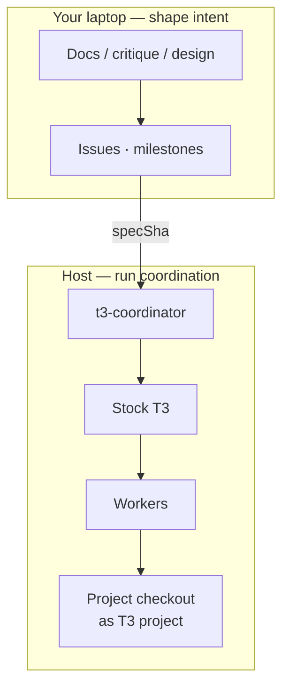

# Where work happens

You need two places set up — a **code project in T3**, and (optionally) **how you prepare specs** on your laptop.



## 1. Project in T3

Add a git checkout as a T3 project. Workers commit there (in isolated worktrees); delivery SHAs and `Coordinated-By` trailers show up in that repo.

**Suggested first project:** [DecisionNerd/dev-skills](https://github.com/DecisionNerd/dev-skills) — small, safe to thrash while you learn the loop. Point at GraphForge/XYG (or anything else) once you are comfortable; update your [operating profile](OPERATING-PROFILE.md) and prompts to match.

| Item | Example (local spike) |
|---|---|
| Repo | `https://github.com/DecisionNerd/dev-skills` |
| Checkout | `/Users/davidspencer/Code/GitHub/dev-skills` |
| T3 project title | `dev-skills` |
| T3 project id | `fcddb699-b5ba-4c4b-a2b7-38ea2bf3e0ed` |

On another machine, clone path and project id will differ — keep them in your profile or a sticky note for `assign_work`.

## 2. Preparing work (laptop)

Before `assign_work`, someone has to produce a committed spec. You can do that with plain GitHub + the supervisor, or with helpers you already like:

| When you are… | Try |
|---|---|
| Writing product/docs spine | DocSlime (or edit docs by hand) |
| Challenging a plan before lock-in | RedTeam (or ask the supervisor to critique) |
| Shaping operator-facing copy/UX | Impeccable (or skip) |
| Driving issues → PR | `issues` / `milestones` / `recon` / `check-readiness` / `merge-it`, or `gh` |

None of that needs to be installed on the remote host. See [DX-PATHS.md](DX-PATHS.md) for full journeys and [OPERATING-PROFILE.md](OPERATING-PROFILE.md) to personalize the helpers.

## On a remote host (e.g. OVHC)

```bash
curl -fsSL https://raw.githubusercontent.com/DecisionNerd/t3-coordinator/main/scripts/install.sh | sh
t3-coordinator auth-issue
t3-coordinator bind-supervisor --environment env-local --thread <supervisorThreadId>
t3-coordinator start
```

Also: T3 running, Temporal CLI on PATH, and the **project checkout** added as a T3 project. Craft skills stay on the laptop (or nowhere).

## Related

[QUICKSTART.md](QUICKSTART.md) · [DX-PATHS.md](DX-PATHS.md) · [OPERATING-PROFILE.md](OPERATING-PROFILE.md)
